# minibadge designer

A web-based designer for [minibadges](https://github.com/lukejenkins/minibadge): upload a
logo, drop as many LEDs as fit on the board (front or back side), add text in a dozen
typefaces and any material, and download a ready-to-fab KiCad project.

```
┌──────────────┐      ┌─────────────────────┐      ┌──────────────────────┐
│ logo + LEDs  │─────▶│ minibadge-designer  │─────▶│ KiCad project (.zip) │
└──────────────┘      └─────────────────────┘      └──────────────────────┘
```

## The walkthrough

Every picture below is from the app's own "?" help, and they all build the
same badge: a helmet-shaped board with copper stripes, a see-through visor
window with a hidden LED behind it, and a stencil name on the back.

| | |
|---|---|
| 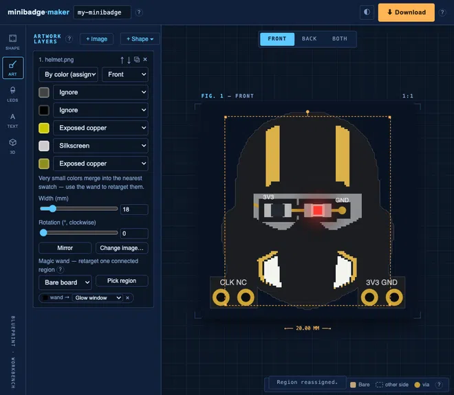 | **One board, two views.** Drag anything on either view; parts on the other side show as dashed ghosts and can be grabbed there too. Select to nudge, resize, rotate to any angle, or delete. |
| 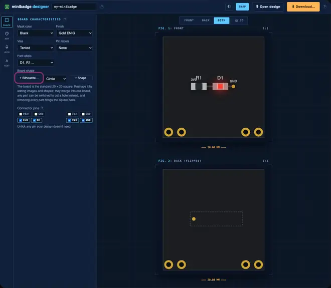 | **Shape the board.** A picture becomes the outline — dark pixels are board, up to ~120 mm across, with edge smoothing for rasters; SVG silhouettes trace exactly. Basic shapes stack on top, each adding material or cutting a hole. No parts = the standard 20 × 20 mm square. |
| 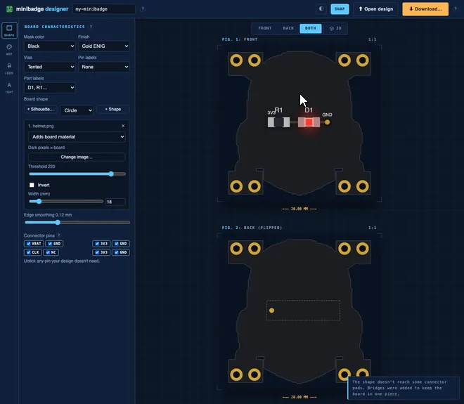 | **Keep only the pins you use.** Every connector pin unticks individually — a pad, a row, a corner. Each row carries 3V3 + GND, so one row powers everything; parts that miss a kept pad are bridged in automatically, and dropping the last power pin blocks downloads until a rail comes back. |
| 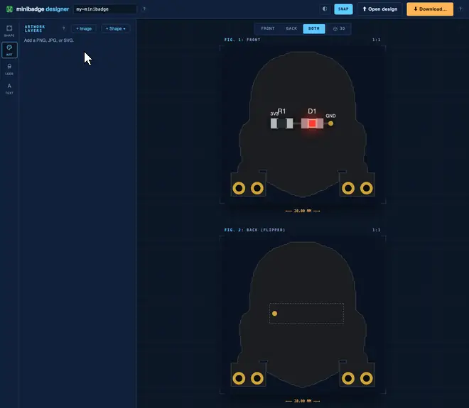 | **Paint it with materials.** Flat-colour art loads in *By color* mode: each colour becomes silkscreen, exposed copper, a glow window, bare board, or is ignored (photos use a threshold mode instead). Rasters snap to a 0.18 mm grid; SVG art stays exact at any size. |
| 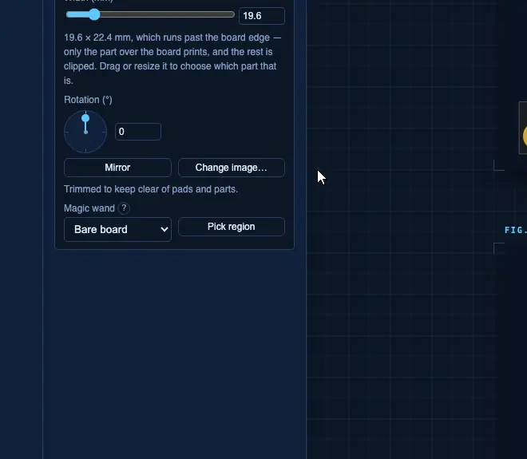 | **The magic wand** retargets one connected region — the visor becomes a window while the same-coloured body stays solid. |
| 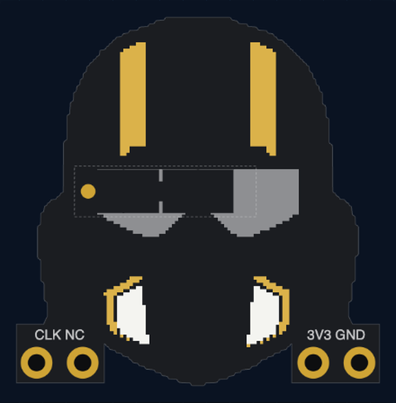 | **What the materials mean.** Silkscreen is white ink; exposed copper shines gold (ENIG) or silver (HASL); glow windows strip the copper so back-side LED light shines through the laminate; bare board opens the mask too. Windows can't cut off power: a metal ring always survives at the board edge, with thin copper links to every LED. |
| 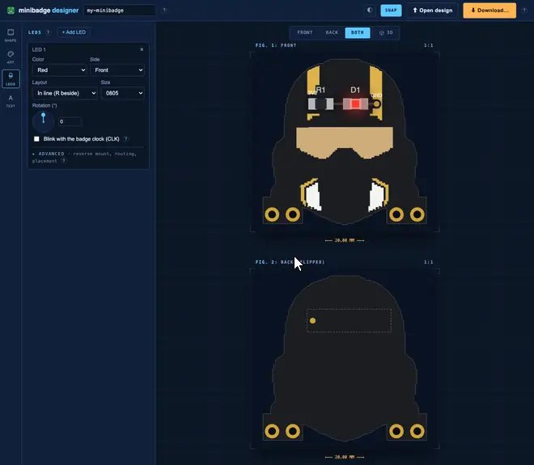 | **LED circuits, pre-routed.** Each LED brings its series resistor, wired 3V3 → R → LED → GND through the copper pours — no routing, and the project passes KiCad DRC out of the box. Either side; SMD 0603/0805/1206 or through-hole domes and bars. |
| 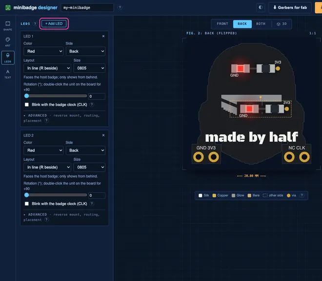 | **When the standard layouts don't fit**, the LED, resistor, and via drag one by one, an LED can skip its via and run a surface trace to any legal pad, and reverse mount / far-side options shine through the board. |
| 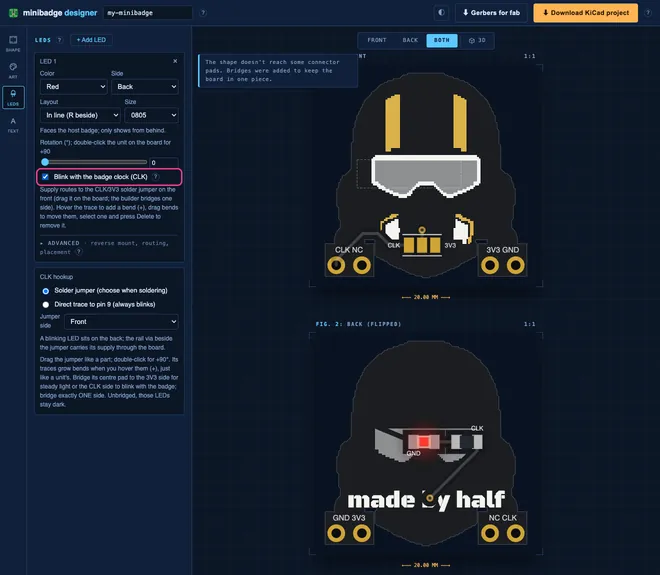 | **Blink with the badge clock.** Any LED can run off the connector's CLK pin instead of steady 3V3 — through the classic 3-pad solder jumper (the builder bridges 3V3 for steady, CLK to blink) or a direct trace to pin 9 that always blinks. |
| 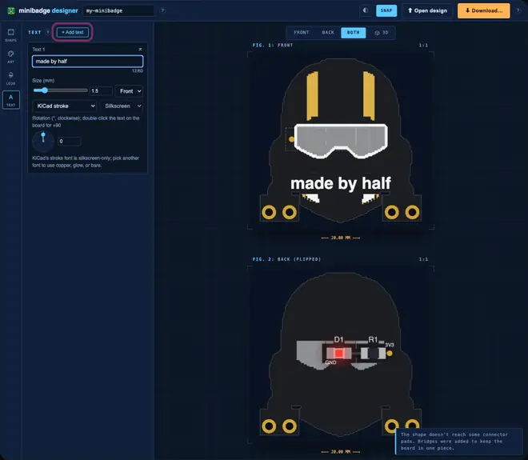 | **Text anywhere**, front or back, 0.8–5 mm: KiCad's stroke font on silk, or a dozen display typefaces (see [Third-party assets](#third-party-assets)) as exact polygons in any material. |
| 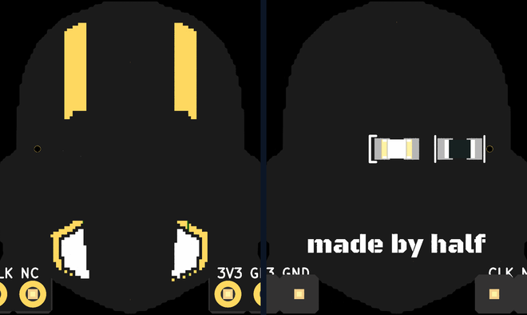 | **The download** — the visor stays dark until the host badge lights its LED — is a complete KiCad 7+ project: board, project file, BOM.csv, and a README.txt with fab/assembly steps. Or skip KiCad: **⬇ Gerbers for fab** plots a zip you upload as-is to JLCPCB or PCBWay (OSH Park prefers the `.kicad_pcb` itself). |

The board sits on the official minibadge v2 connector footprint (pad geometry
follows [lukejenkins/minibadge](https://github.com/lukejenkins/minibadge),
Apache-2.0). VBATT and NC stay unconnected per the standard; CLK joins the
netlist only when an LED runs on it.

## How It Works

- The browser canvas runs the same threshold math the server uses — the
  silkscreen you see is the silkscreen you get — and on download Flask
  (`webapp.py`) turns rasters into run-length-merged rectangles (`logo.py`),
  SVGs into exact polygons (`svgart.py`), and emits the `.kicad_pcb` with
  shapely-computed zone fills (`pcb.py`).
- In KiCad, press **B** once to refill zones: the shipped fills are already
  DRC-clean, refilling just replaces the thin slits the file format forces
  with proper holes. Light windows carry keepouts so the refill leaves them
  clear.
- **⬇ Gerbers for fab** does that refill server-side (`kicad-cli` required)
  and plots RS-274X Gerbers plus a merged Excellon drill file.

## Architecture

| Component | Responsibility |
|---|---|
| `minibadge_designer/webapp.py` | Flask app: serves the UI, validates params, zips the project |
| `minibadge_designer/pcb.py` | `.kicad_pcb` / `.kicad_pro` / BOM generation, zone-fill geometry |
| `minibadge_designer/logo.py` | image → thresholded silkscreen rectangles with keepouts |
| `minibadge_designer/templates/index.html` | canvas editor: front + mirrored back views, drag logo/LEDs |

## Running it with Docker (recommended)

Docker is the supported way to run minibadge-designer and the only one that is
feature-complete out of the box. The image carries KiCad's command line tools,
so the interactive **3D view** works, generated boards are **DRC-clean**, and
the 3D model shows the **populated board** in real part colours. The host needs
nothing but Docker: no KiCad, no Python.

### Requirements

- Docker Engine 20.10+ (or Docker Desktop) with the Compose plugin
- ~1 GB of disk for the image, and network access during the build

### Start it

```bash
git clone <this repo> && cd minibadge-designer
docker compose up --build       # first build takes a few minutes
```

Then open <http://localhost:8000>. Use `Ctrl-C` to stop, or run it detached:

```bash
docker compose up -d --build    # background
docker compose logs -f          # follow the log
docker compose down             # stop and remove
```

Rebuild after changing the code with `docker compose up --build`; only the
layers you touched are redone. The port is published on **loopback only**
(`127.0.0.1:8000:8000`), so the app is reachable from this machine and not
from the network. To serve on another port, change the middle field of that
`ports` mapping (`"127.0.0.1:9000:8000"`); to deliberately serve other people
on the LAN, drop the `127.0.0.1:` prefix.

### What the build does

1. Pulls KiCad 9.x from Debian and keeps **only the ten 3D models** this app
   can place; the stock library is ~5 GB, this is half a megabyte. The result
   is ~800 MB rather than the 6.3 GB of the official `kicad/kicad:9.0-full`.
2. Fetches the third-party runtime assets (typefaces, `<model-viewer>`) by
   pinned version and SHA-256; see [Third-party assets](#third-party-assets).
3. Runs a **smoke test**: it exports a two-LED board and fails the build if
   the component models did not resolve or lost their colours. Every way this
   has broken before was silent, producing a perfectly valid export of an
   empty board, so the build refuses to ship one.

The container runs as a non-root user and reports health to Compose. A `.env`
file is picked up if present but is not required.

### Serving more than one person

The container serves through **gunicorn with 4 single-threaded worker
processes** (`gunicorn.conf.py`), so simultaneous users get parallel workers
rather than queueing behind one interpreter. Process isolation is also what
makes concurrent exports safe by construction, since every request works in
its own temp directory with its own kicad-cli. Tune per host via `.env`:

- `WEB_CONCURRENCY`: worker count (default 4; ~100 MB each, 2 × cores is a
  sane ceiling)
- `WORKER_TIMEOUT`: per-request ceiling in seconds (default 300; the GLB
  export and zone refill each carry a 120 s subprocess budget, and the
  timeout doubles as the backstop that recycles a worker stuck on a
  pathological upload)
- `PORT`: bind port inside the container (default 8000)
- `HOST`: bind address inside the container (default `0.0.0.0`, which is
  the container's own namespace — what the outside world can reach is set
  by the `ports` mapping above, not by this)
- `MAX_REQUESTS`: requests a worker serves before it is recycled (default
  `200`) — memory hygiene under the container's hard limit, not a leak fix
- `EXPORT_BUDGET_S`: wall clock one `/gerbers` or `/model3d` request may spend
  in subprocesses (default `240`). Keep it comfortably under `WORKER_TIMEOUT`,
  or a slow export is killed before it can report that it was slow.
- `FORWARDED_ALLOW_IPS`: which peer gunicorn accepts forwarded headers from
  (default `127.0.0.1`, the reverse proxy on this host)

The visitor's address comes from Cloudflare's `CF-Connecting-IP`, not from
counting positions in `X-Forwarded-For`. Counting does not work here: the local
proxy's two usual configurations either append its peer (making the rightmost
entry Cloudflare's edge) or overwrite the header outright (losing the visitor
entirely), and both were measured resolving to the edge address rather than the
person. `CF-Connecting-IP` is a single value that Cloudflare overwrites on every
request, so there is no chain to count.

That is only sound while the app is unreachable except through Cloudflare, which
is what the loopback-only `ports` mapping buys. **If the origin is ever exposed
directly, the header becomes forgeable** and the check has to become "is the peer
a Cloudflare address".

### Limits on what one request can spend

Every route is unauthenticated and decodes a file the caller chose, so each of
these has a ceiling. All are documented in place with the measurement that set
them; the numbers to know are:

| Ceiling | Where | Refuses |
| --- | --- | --- |
| 24 megapixels per upload | `logo.MAX_INPUT_PIXELS` | Read off the header, before a row is decoded — the only place a memory guard can stand, since PNG decoding is all-or-nothing |
| 4 megapixels working size | `logo.WORK_MAX_PIXELS` | The reduction happens before the RGBA conversion and the rotate, so peak memory tracks the badge and not the file |
| 40 000 weighted SVG segments | `webapp.MAX_SVG_COMPLEXITY` | Scored on the *render tree* including `<use>` expansion, so a 1 KB file that expands to 130 000 shapes is priced as 130 000 |
| 6 000 outline rectangles | `webapp.MAX_OUTLINE_RECTS` | One allowance shared by all twelve outline elements. Set at the measured knee: `/outline` runs on every edit |
| 24 MiB per request | `webapp.MAX_UPLOAD` | Flask `MAX_CONTENT_LENGTH` |
| 3 GB / 2 CPU / 512 pids | `docker-compose.yml` | The container, so the host is never the thing that runs out |

The container also runs read-only (`/tmp`, `/dev/shm` and `/home/badge` are
tmpfs — kicad-cli needs a writable `HOME`), as a non-root user, with
`no-new-privileges`.

Two things the app cannot do for itself, both at the edge: the
`http://` → `https://` redirect and rate limiting. The security headers,
including HSTS, are sent from the origin so they survive a change of provider.

## Branches, CI, and deploying

`dev` is the working branch; `main` is the deploy branch. Merging (or pushing)
to `main` is what ships.

| Workflow | Trigger | What it does |
| --- | --- | --- |
| `.github/workflows/ci.yml` | push to `dev`, PRs into `dev`/`main` | Builds the image (whose last stage smoke-tests the 3D pipeline) and runs the test suite *inside* it, so tests see the same kicad-cli and build-time assets the container serves with. |
| `.github/workflows/deploy.yml` | push to `main`, manual dispatch | On the deploy host: fast-forwards `/opt/minibadge-designer` to the pushed commit, `docker compose up -d --build --wait`, and fails the job if the healthcheck never passes. |

The two run on different machines, on purpose. **CI runs on a GitHub-hosted
runner (`ubuntu-latest`); only the deploy runs on the self-hosted runner `badge`
(`self-hosted, Linux, X64`), which is also the server.**

Both used to run on `badge`, so that CI's build warmed the layer cache the
deploy reuses. That was the sharpest edge in the setup: a self-hosted runner
executes whatever the commit it checked out says to execute, on the machine that
serves the site, and the runner user is in the `docker` group — which is
root-equivalent on the host. Every commit that reached CI therefore had a route
to the production box that did not go through `deploy.yml` at all. Splitting CI
onto a disposable VM closes that route: the only thing that runs on `badge` now
is a push to `main`.

The cost is the warm cache. Deploys still reuse the layers left by the previous
deploy, so it is only felt when a change lands early in the `Dockerfile` —
`requirements.lock`, or either apt stage.

CI is still gated to **same-repository commits only**: a pull request from a
fork is skipped, not built (see the `if:` on the job in `ci.yml`). On a hosted
runner that is no longer a security boundary — the VM is disposable, the token
is read-only, and no secrets reach it — so it is now just a guard on runner
minutes, and it can be dropped if you want fork PRs to test themselves.

Two things CI deliberately does not cover: the **browser tier** (no Chromium in
the image; run `pytest -m browser` locally) and the **visual tier**, which
never gates anywhere because renders are not deterministic at the artifact
level. Run the full local suite before merging to `main`.

To roll back, point the deploy clone at the previous commit and bring it up:

```bash
cd /opt/minibadge-designer
git reset --hard <previous-sha>
docker compose up -d --build --wait
```

## Running it with local Python (development)

```bash
python3 -m venv .venv
source .venv/bin/activate
pip install -e ".[dev]"
python3 scripts/fetch_assets.py     # one-time: typefaces + 3D viewer
minibadge-designer                  # serves http://127.0.0.1:8000
pytest
```

Good for fast edit/reload cycles, but not feature-complete unless you also
install **KiCad 9.x**: without it the 3D view returns an error pointing at the
downloaded project, and the DRC tests skip instead of running. The app looks
for `kicad-cli` in `$KICAD_CLI`, on `PATH`, and at the standard macOS and Linux
install paths. Everything else (the editor, artwork, and project download)
works with Python alone.

## Third-party assets

This repository contains no third-party files. The typefaces and the
`<model-viewer>` web component belong to other projects under other licences,
so they are downloaded on setup instead of being committed here:

```bash
python3 scripts/fetch_assets.py            # fetch (Docker does this for you)
python3 scripts/fetch_assets.py --check    # verify what is installed
```

Every asset is pinned to an exact version and verified against a SHA-256, so a
re-fetch cannot silently change a glyph; a mismatch aborts rather than
installing. The script records what it fetched, and under which licence, in
`minibadge_designer/fonts/THIRD-PARTY-NOTICE.txt`:

| Asset | Source | Licence |
|---|---|---|
| 11 display typefaces | [google/fonts](https://github.com/google/fonts) (pinned commit) | SIL Open Font License 1.1 |
| Special Elite | [google/fonts](https://github.com/google/fonts) (pinned commit) | Apache License 2.0 |
| `<model-viewer>` 4.0.0 | [google/model-viewer](https://github.com/google/model-viewer) | BSD 3-Clause |

KiCad's 3D model libraries are likewise never vendored: the Docker image
installs them from Debian at build time (CC-BY-SA-4.0 with the KiCad library
exception).

## CLI Reference

```
minibadge-designer [--host HOST] [--port PORT] [--debug]
```

## Credits

Minibadge standard, spec, and connector footprint: Luke Jenkins and contributors,
[lukejenkins/minibadge](https://github.com/lukejenkins/minibadge) (Apache-2.0).
