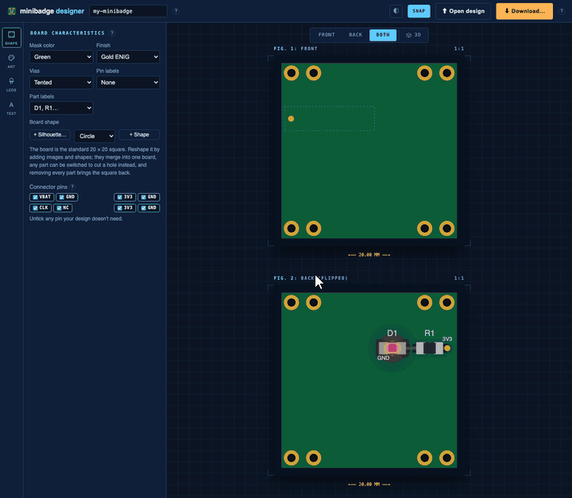

# minibadge designer

A web app for designing [minibadges](https://github.com/lukejenkins/minibadge),
the small add-on boards that clip onto a conference badge and light up from its
power. You draw the badge in the browser, and the app hands you a KiCad project,
or a Gerber zip that a board house can make as-is.



You don't need to know PCB design. Upload a logo, put LEDs where you want
light, type some text, download. The connector, the resistors, the copper and
the design-rule checks are done for you. If you do know KiCad, the download
opens there and you can take it as far as you like.

## Getting started

You need Docker with the Compose plugin, and about 1 GB of disk for the image.

```bash
git clone https://github.com/BreydenSummers/minibadge-designer.git
cd minibadge-designer
docker compose up --build
```

The first build takes a few minutes, because it installs KiCad's command-line
tools inside the image so that the 3D view and the Gerber export work without
KiCad on your machine. Then open <http://localhost:8000>.

To run it in the background:

```bash
docker compose up -d --build    # start
docker compose logs -f          # watch it
docker compose down             # stop
```

It only listens on this machine, so to share it on your network you remove the
`127.0.0.1:` prefix from the `ports` line in `docker-compose.yml`. Nothing else.

### Without Docker

```bash
python3 -m venv .venv && source .venv/bin/activate
pip install -e ".[dev]"
python3 scripts/fetch_assets.py     # downloads the typefaces and 3D viewer, once
minibadge-designer                  # http://127.0.0.1:8000
```

Everything works this way except the 3D view and the Gerber export, which need
KiCad 9 installed.

## Designing a badge

Every control has a "?" next to it with a short animation of what it does. A
badge usually comes together in this order:

1. Start with the board shape. The default is the standard 20 × 20 mm square,
   and if you upload a picture its dark pixels become the outline instead, up to
   about 120 mm across.

2. Drop in the artwork, and each colour becomes a material: white silkscreen,
   exposed gold or silver copper, a see-through window that glows from an LED
   behind it, or bare board. The magic wand retargets one region when two areas
   share a colour.

3. Place the LEDs on either side, and each one brings its own resistor and is
   wired to the connector's power for you, so putting one behind a window is all
   it takes to light the artwork up. Any of them can blink.

4. Add text, front or back, in KiCad's stroke font or one of a dozen display
   typefaces, in any of the materials above.

5. Download. You get a KiCad project with the board, a BOM and assembly notes,
   or you tick **Gerber fab package** for a zip that goes straight to JLCPCB or
   PCBWay, and either way the board already passes KiCad's design rule check.

Everything you place can be dragged, resized and rotated on either view, and
parts on the far side show through as dashed ghosts so you can grab them from
there too. Snap is on by default. Hold Alt to skip it for one move.

## Running it for other people

For a public or shared install, [docs/OPERATIONS.md](docs/OPERATIONS.md) covers
the worker settings in `.env`, the logs, the ceilings on what one upload may
cost, and how the site deploys.

## Development

```bash
pytest                  # the fast suite
pytest -m browser       # the Playwright UI tests, needs Chromium
```

`dev` is the working branch. Merging into `main` deploys.

## Credits

The minibadge standard and connector footprint are by Luke Jenkins and
contributors, [lukejenkins/minibadge](https://github.com/lukejenkins/minibadge)
(Apache-2.0). The typefaces and the `<model-viewer>` component belong to other
projects, so they are downloaded at setup, with each licence recorded in
`minibadge_designer/fonts/THIRD-PARTY-NOTICE.txt`.
